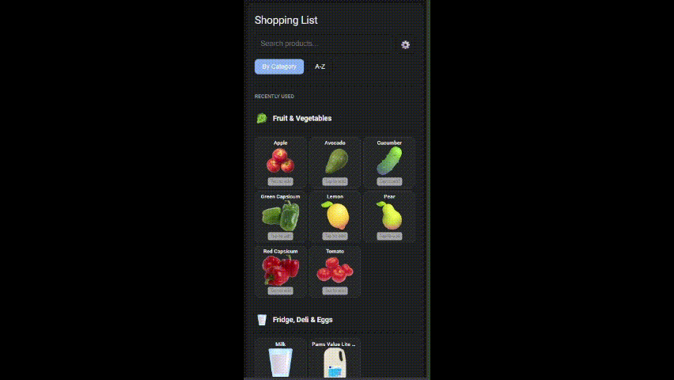

# Shopping List Manager Card

A custom Lovelace card for the **Shopping List Manager** integration.

This card provides the user interface only and communicates with the integration via WebSocket.

👉 [What This Card Can Do](#-what-this-card-can-do)

Sorry for the quality.



---

## 1. Installation (HACS)

### Recommended

[](https://my.home-assistant.io/redirect/hacs_repository/?owner=thekiwismarthome&repository=shopping-list-manager-card&category=plugin)

1. Click the button above.
2. Confirm adding the repository to HACS.
3. Install **Shopping List Manager Card** from **HACS → Frontend**.
4. Reload the dashboard.

---

### Manual Repository URL

https://github.com/thekiwismarthome/shopping-list-manager-card

Repository type: **Lovelace**

---

## 2. Lovelace Setup

Add the card to your dashboard:

```yaml
type: custom:shopping-list-manager
title: Shopping List
list_id: groceries
```
and to add HA Card Grids
```yaml
type: custom:shopping-list-manager-card
title: Shopping List
list_id: groceries
grid_options:
  columns: 12
  rows: auto
```
## 3. Requirements

Home Assistant with HACS

Shopping List Manager integration installed

[](https://my.home-assistant.io/redirect/hacs_repository/?owner=thekiwismarthome&repository=shopping-list-manager&category=integration)

## 4. Notes

This repository contains frontend code only

The backend integration is installed separately

Polling is used by design

Live WebSocket subscriptions are not enabled

## ✨ What This Card Can Do

The **Shopping List Manager Card** provides a clean, touch-friendly interface for managing your shopping list in Home Assistant.

It is designed to be fast, intuitive, and resilient, even on mobile devices.

---

## 🔑 Key Features

### 🛒 Product-First Shopping Experience
- Displays your full product catalogue
- Tap a product to add or remove it from the active shopping list
- Adjust quantities with simple + / − controls
- Optimistic UI updates for instant feedback

---

### 🖼️ Smart Images & Emoji Fallback
- Automatically uses **local product images** when available  
  (`/config/www/images/shopping_list_manager/`)
- Intelligently matches filenames to product names
- Falls back to a **relevant emoji** when no image is found
- Uses a generic 🛒 icon as a final fallback

This means:
- No broken image icons
- No required configuration
- Products always have a visual representation

---

### 🔍 Powerful Search
- Instant, fuzzy search (handles partial matches and typos)
- Search by product name or category
- During search, inactive and recently used items remain visible
- Quickly add new products directly from the search bar

---

### 🗂️ Category-Aware Layout
- Products are grouped by category
- Categories are displayed in a logical, configurable order
- Optional compact category headers for dense layouts

---

### 📱 Mobile-First & Touch Friendly
- Large tap targets
- Long-press or right-click to edit products
- Haptic feedback support (optional)
- Works well on phones, tablets, and desktops

---

### 🔄 Polling-Based by Design
- Uses polling to stay in sync with the backend
- No persistent WebSocket subscriptions
- Safe, predictable, and resilient to connection drops

---

### ⚙️ Built-In Settings
- Grid or list layout
- Adjustable products per row
- Hide completed items
- Compact category headers
- Optional haptic feedback

Settings are stored locally per card instance.

---

## 🧠 Design Philosophy

- Frontend-only: no backend coupling
- No entities required
- No YAML editing after installation
- Safe defaults, minimal configuration
- Designed to evolve without breaking changes

---

## ❗ What This Card Does *Not* Do

- Does not store data itself
- Does not create Home Assistant entities
- Does not push live updates (polling is intentional)
- Does not require cloud access

All data is owned by the **Shopping List Manager integration**.

